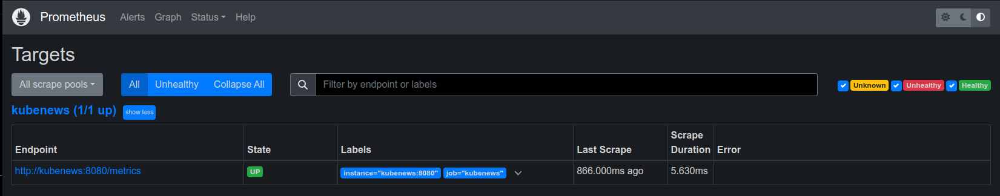
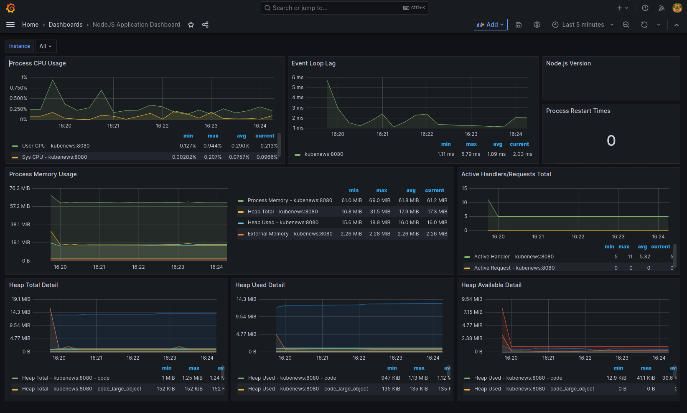

# Modernization of the kube-news Application 🚀

The modernization of the `kube-news` application focuses on incorporating tools and practices that elevate the level of quality, security, and monitoring of the project, ensuring it is prepared for the demands of modern development and operation in complex production environments.

## Key Technologies Implemented

- **DevContainers**: Enabling a consistent and easily replicable development environment. 📦

- **Prometheus & Grafana**: Introducing a monitoring and visualization system to observe real-time metrics and ensure optimal performance. 📊

- **Docker & Docker Compose**: Containerizing services to facilitate deployment and scalability. 🐳

- **Trivy & Hadolint**: Static analysis tools for identifying vulnerabilities and ensuring best practices in Dockerfiles. 🔒

## Benefits

- **Environment Consistency**: With **DevContainers**, every developer works in an identical environment, eliminating the "works on my machine" problem. 💼

- **Enhanced Observability**: The implementation of **Prometheus and Grafana** provides detailed insights into the application's health, facilitating early problem detection. 🛠️

- **Reinforced Security**: The use of **Trivy and Hadolint** ensures that container images are free from known vulnerabilities and comply with best practices. 🛡️

- **Simplified Development and Operation**: Containerization with **Docker and Docker Compose** simplifies the deployment and management of the application in any environment. 🔄

## Application Preview 📦

## Prometheus Metrics 📊

![Prometheus Metrics]

## Grafana Dashboard 📊

